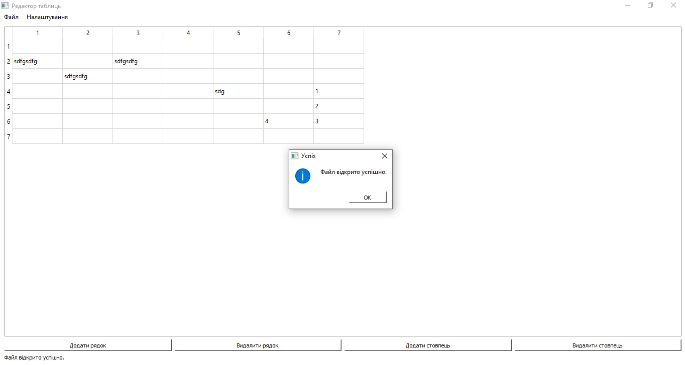
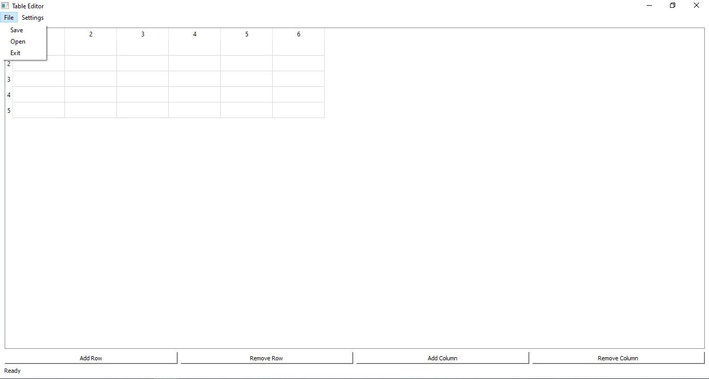

# QT Table Editor
Easy table editor

### Clone repository and install program:

- git clone https://github.com/SafonovVladimir/QT_table_editor.git
- cd QT_table_editor
- python -m venv venv 

#### Linux/macOS:
- source venv/bin/activate
- pip install -r requirements.txt
#### Windows: 
- venv\Scripts\activate
- pip install -r requirements.txt

## Make and run executable file:
- pyinstaller main.py --onefile
- run main.exe file from dist folder

## Features
- Choose language before run program
- Add and remove rows and columns
- Write something into cell
- Save and open File with result
- Choose Theme: Dark or Light  

# Screenshots:
Choose language window:

Main window (ua):

Open file success:

Choose theme (ua):

Main window with File menu (eng):
